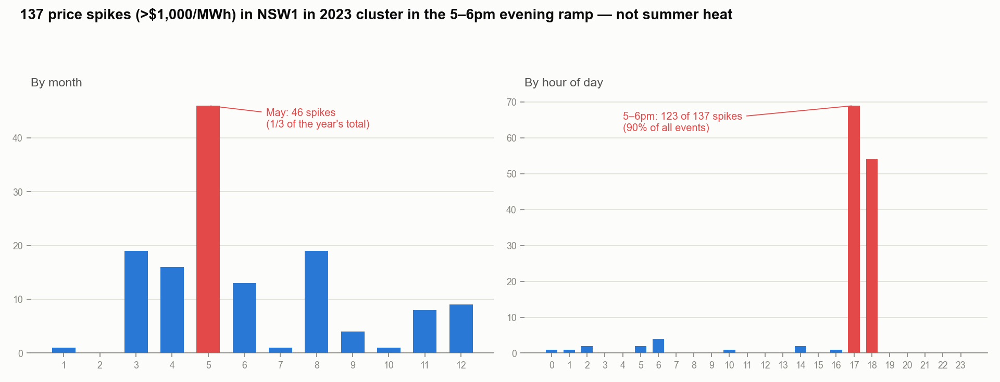
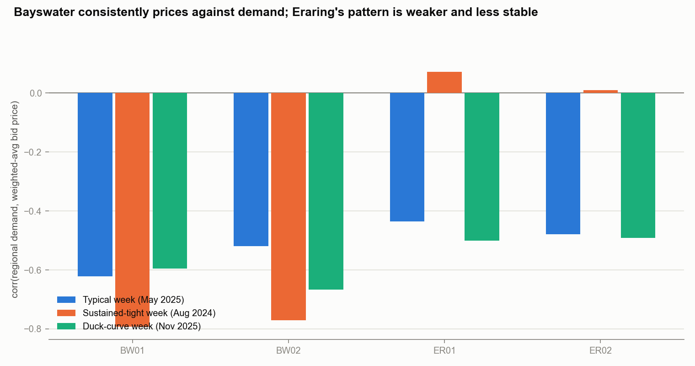
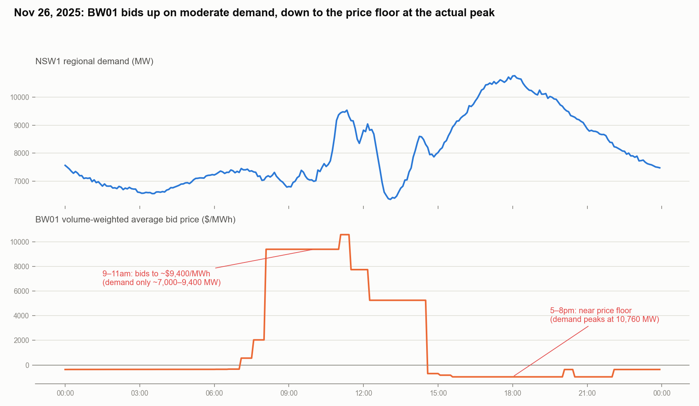

# The NSW1 5-6pm Problem

*A data-driven diagnosis of evening price volatility in the NEM, built on real AEMO bid and dispatch data.*

---

## Executive Summary

NSW1 recorded 137 price spikes above $1,000/MWh in 2023. 90% of them hit in one two-hour window: 5-6pm. That's the evening ramp of the duck curve.

We tested the standard assumption that generators price this window on scarcity: price rises as reserve margin falls. Across three independent real weeks, that assumption fails. Bayswater's two units price *against* demand instead: cheaper at the actual peak, more expensive when demand is only moderate. Eraring's units show a much weaker, less stable version of the same pattern.

**Recommendation:** replace generic scarcity-alpha assumptions with plant-specific, demand-indexed bidding curves estimated from real bid data, and validate before using in any policy or investment scenario.

---

## 1. What's the Problem

In 2023, NSW1 traded mostly in the $50-150/MWh range. But price broke $1,000/MWh 137 times, and once hit the $16,599/MWh cap. Average demand at a spike: 10,041 MW, 34% above the annual average.



- **May alone holds a third of the year's spikes.** Not the hottest month, so heatwave demand isn't the main driver.
- **90% of spikes occur at 5-6pm**, right where solar output drops off faster than evening demand falls. This is a recurring structural feature, not a tail event.

## 2. Why It Matters

- **Retailers and consumers absorb the cost.** A handful of 5-6pm intervals a year can dominate a retailer's wholesale cost base and flow through to tariffs.
- **The fleet covering this window is shrinking.** Bayswater and Eraring, the two stations behind every DUID in this analysis, hold close to 3,000 MW of NSW1 capacity. Eraring is on a public retirement timeline. Storage, peakers, and demand response will be sized against models of how this fleet behaves under stress. If those models assume textbook scarcity pricing and the real fleet doesn't bid that way, the resulting investment signals will be wrong exactly when it matters most.

## 3. What We Recommend

We pulled real `BIDDAYOFFER_D`/`BIDPEROFFER_D` bids for Bayswater (BW01, BW02) and Eraring (ER01, ER02), plus real AEMO reserve-margin data, across three real weeks chosen to stress-test the scarcity assumption:

| Window | What it represents | Reserve margin range |
|---|---|---|
| May 2025 | Typical, uneventful week | 1,290 - 9,581 MW |
| Aug 2024 | Sustained tight week (day-average RRP $2,145/MWh) | 792 - 8,767 MW |
| Nov 2025 | Duck-curve day (RRP swung from -$999 to the $20,300 cap same day) | 1,131 - 11,245 MW |

The naive hypothesis, price rises as margin tightens, failed in all three:



- **Bayswater prices against demand, consistently.** Correlation between demand and its weighted-average bid price runs -0.5 to -0.8 in every window, calm or stressed.
- **Eraring's pattern is weaker and unstable.** Near zero in the calm week, only turning meaningfully negative under stress. Same fuel, same region, different bidding logic, plausibly tied to its retirement timeline.

One day makes the mechanism concrete. On November 26, 2025:



BW01 bid up to a blended ~$9,400/MWh at 9-11am, when demand was only 7,000-9,400 MW. It bid down to the price floor during the day's actual peak of 10,760 MW at 5-8pm. The unit prices low when it wants to guarantee dispatch, and prices its optional capacity high when running isn't necessary. That's self-preservation bidding, not a scarcity markup, and a replacement model needs to capture it per plant, not per fuel type.

**Concretely:**
1. Replace the single "scarcity alpha" parameter with plant-specific curves indexed to demand, estimated from each unit's bid history.
2. Keep Bayswater and Eraring separate. Pooling them into one "coal baseload" curve erases the signal.
3. Validate any such model against a real historical event before using it for policy or investment work.

## 4. Expected Benefit

A demand-indexed, plant-specific model should improve forecast accuracy exactly where it matters most financially: the narrow evening window a generic scarcity curve gets most wrong.

- **Investment timing.** Size storage and peaker capacity against how these plants actually bid, not a textbook assumption.
- **Policy calibration.** Set Market Price Cap and Cumulative Price Threshold levels against realistic bidding behavior, not an averaged fiction.
- **Retirement readiness.** A model that already separates Eraring from Bayswater can answer what happens to the 5-6pm window once Eraring exits, without a rebuild.

**This is Phase 1: diagnosis and mechanism.** The backtest below is Phase 2.

## 5. Phase 2: Backtest

The plan was to validate against a real AEMO Market Price Cap or Cumulative Price Threshold event. NSW1 has triggered Administered Pricing only once, May 8 to 15, 2024, and that window sits inside the exact gap where AEMO's bid archive has no data. No bid data exists to test against it.

Instead we ran a leave-one-month-out backtest on 23 independent real months (Aug 2024 to Jun 2026). Each month is held out in turn while the rest train the model. Two models, both fit on demand-binned average bid price, are compared: one curve per unit versus one curve pooled across all four units.

Results across 92 held-out unit-months:
- Direction (price rising or falling with demand) matched the held-out month 93% of the time.
- The pooled curve did worse than just predicting the training-period average price (R² -0.12).
- The plant-specific curve beat that baseline (R² 0.12) and cut prediction error 11% versus the pooled curve.
- The gain was small for Bayswater (about 4%) and large for Eraring (15-25%). Pooling lets Bayswater's bigger swings distort Eraring's curve.

This supports keeping Bayswater and Eraring separate. It does not mean demand alone predicts price well: it explains only about 12% of the variance. Reproduce with `fetch_monthly_bids.py` then `backtest_holdout.py`.

---

## Appendix: Data & Methodology

All figures come from real AEMO data pulled via [NEMOSIS](https://github.com/UNSW-CEEM/NEMOSIS).

| Data | Source | Used for |
|---|---|---|
| 2023 NSW1 demand & price | `nsw1_2023.csv` | Exhibit 1 |
| Bid price ladders | `BIDDAYOFFER_D`, `BIDTYPE == ENERGY` | 10-band daily price ladder per DUID |
| Bid volume ladders | `BIDPEROFFER_D`, `BIDTYPE == ENERGY`, deduplicated to the latest live rebid | 5-minute volume per band per DUID |
| Regional demand & availability | `DISPATCHREGIONSUM` | Reserve margin = `AVAILABLEGENERATION - TOTALDEMAND` |
| Generator identity | `duid_generator_registry.csv` | Confirmed BW01/BW02 = Bayswater (660 MW reg cap each), ER01/ER02 = Eraring (720 MW reg cap each), both NSW1 coal |

**Units analyzed:** BW01, BW02 (Bayswater), ER01, ER02 (Eraring), the four largest coal DUIDs in NSW1.

**Data availability:** `BIDDAYOFFER_D`/`BIDPEROFFER_D` are missing from AEMO's archive between March 2021 and July 2024. Real 2023 bid data doesn't exist, so the bidding-behavior analysis and backtest use real months from August 2024 onward instead. Exhibit 1 uses 2023 demand/price data directly, which has no such gap.

**Per-interval reconstruction:** `BIDPEROFFER_D` restates every remaining interval each time a unit rebids intraday, so a naive join keeps superseded rows. We keep only the most recent rebid actually in effect (`OFFERDATE <= INTERVAL_DATETIME`, latest wins) before computing each unit's weighted-average bid price per interval.

## Repository Structure

```
spike_diagnostic.py           # 2023 NSW1 spike-timing diagnosis (Exhibit 1 data)
fetch_real_bids_nemosis.py    # Template: pull real bid + SCADA data via NEMOSIS
merge_bid_bands.py            # Merge BIDDAYOFFER_D + BIDPEROFFER_D into a full 10-band ladder
find_real_spike_days.py       # Scan 2024-08 onward for genuine NSW1 price-spike days
scarcity_curve.py             # Core analysis: real bid price vs. real reserve margin / demand
make_exhibits.py              # Generates exhibit1/2/3 PNGs used in this README
fetch_monthly_bids.py         # Phase 2: pull every available real month for the backtest
backtest_holdout.py           # Phase 2: leave-one-month-out backtest, plant-specific vs. pooled curve
nsw1_2023.csv                 # 2023 NSW1 half-hourly demand & price
duid_generator_registry.csv   # AEMO generator registration list
nemosis_cache/                # Cached NEMOSIS downloads + parquet outputs, gitignored, several GB
```

**To reproduce:** `pip install nemosis pandas numpy pyarrow matplotlib`. Run `fetch_real_bids_nemosis.py` once to populate the cache, then `scarcity_curve.py <window_label>` (`sustained_2024aug` or `duckcurve_2025nov`), then `make_exhibits.py` for the charts. For the backtest, run `fetch_monthly_bids.py` to pull all available real months, then `backtest_holdout.py`. `nemosis_cache/` is not tracked in git (see `.gitignore`): it holds raw AEMO downloads and rebuilds locally on first run.
